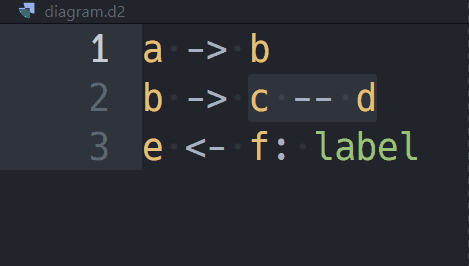

# d2-arrow README

Utils for [d2](https://d2lang.com/) file.

## Features

### `d2-arrow.continue` (alt+enter)

Insert new line so that the d2 operators (`->`, `<-`, `--`, `<->`) continue from current line.
The new line consists of the following elements:

- The last element of previous line
- The last operator of previous line

### `d2-arrow.swap`

- Swaps elements before and after the operator.
- With text selection, the first and last elements of the selection are swapped.
- If selection is empty, the first and last elements of the line are swapped.

---

**Enjoy!**
